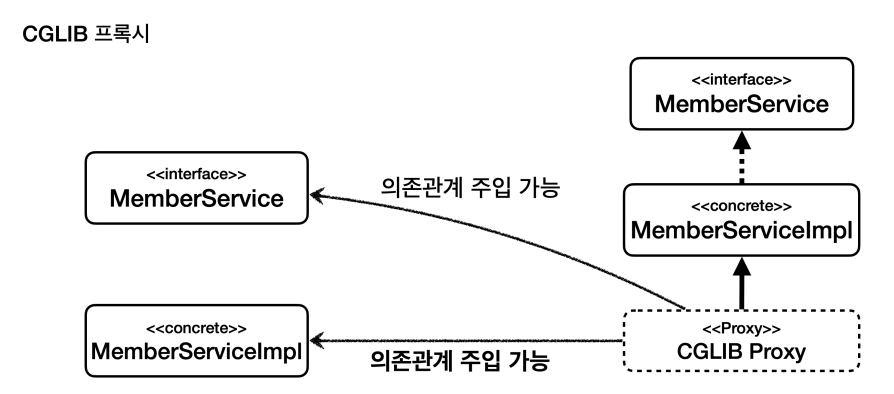

# **동적 프록시**

로그 추적기 적용을 위해 가장 간단한 방법인
1. 각 클래스마다 로그 추적기 주입
2. 동시성 문제를 위한 스레드로컬 도입
3. 템플릿 콜백 패턴과 전략 패턴 활용
4. 프록시 패턴과 데코레이터 패턴 적용

을 순서대로 구현해봤다.

프록시 패턴을 이용해
- 접근 제어
- 부가 기능 추가

기능을 사용할 수 있게 되었지만, 결국 프록시 클래스를 필요한 만큼 추가해주어야 하는 문제점이 남았다.

이를 `동적 프록시`를 이용해 해결하는 방법을 해당 브랜치에서 구현한다.


### 리플렉션

> 자바 리플렉션 활용

- reflection0() : 공통 로직 사이에 개별 로직 존재
- reflection1() : 리플렉션 예제
- reflection2() : 리플렉션을 이용해 추상화 + 리팩토링(로직 통일)

**주의**

리플렉션을 사용하면 클래스와 메서드의 메타정보를 사용해 애플리케이션을 동적으로 `유연`하게 만들 수 있다.

하지만, 런타임에 동작하기 때문에 컴파일 시점에 오류를 잡을 수 없다는 치명적 문제(문자열 하드코딩)와, 성능 저하 문제가 있기 때문에 주의해서 사용해야 한다.

1. 성능 저하 (JVM 최적화, JIT 컴파일) 
2. 타입 안정성 부족(Type Safety X)
3. 접근 제한 우회
4. 예외 처리 복잡
---

# JDK 동적 프록시

- 동적 프록시 예제 세팅

`TimeInvocationHadler`
- TimeInvocationHandler는 InvocationHandelr를 구현
- 이렇게 해야 JDK 동적 프록시에 적용할 공통 로직을 개발 가능
- Object target : 동적 프록시가 호출할 대상
- method.invoke(target, args) : 리플렉션을 사용해서 `target` 인스턴스의 메서드를 실행
    - `args`는 메서드 호출시 넘겨줄 인수

### TimeInvocationHandler 동적 프록시 동작 과정
1. 클라이언트는 JDK 동적 프록시의 `call()` 을 실행
2. JDK 동적 프록시는 `InvocationHandler.invoke()`를 호출 (동적 프록시가 call() 호출을 가로챔)
   - `TimeInvocationHandler`가 구현체로 있기 때문에 `TimeInvocationHandler.invoke()`가 실제로 호출
3. `TimeInvotaionHandler`가 내부 로직을 수행하고, `method.invoke(target, args)`를 호출해서 `target`인 실제 객체 `AImpl(BImpl)`를 호출
4. AImpl(BImpl) 인스턴스의 `call()` 이 실행
5. `call()`의 실행이 끝나면 `TimeInvocationHandler`로 응답이 돌아온다.
   - 시간 로그를 출력하고 결과를 반환

> 정리하면, AImpl과 BImpl의 프록시 객체를 각각 생성하지 않고, 동적으로 만들어 공통으로 사용할 수 있게 되었다.
---

### 실제 애플리케이션 로직에 적용
#### `LogTraceHandler`

- `InvocationHandler` 인터페이스를 구현해 JDK 동적 프록시에서 사용됨
- private final Object target : 프록시 대상
- String message : `LogTrace`에 사용할 메시지

> JDK 동적 프록시는 인터페이스 기반으로 동작하기 때문에, 타겟의 모든 메서드 호출을 가로챌 때는 해당 메서드가 인터페이스에 정의되어 있어야 한다.
<br>
> 이를 이용해 프록시가 가로채길 원하지 않는 경우, 따로 구현 클래스에 정의해주면 된다.

그런데 지금은 인터페이스에 `no-log()` 메서드도 정의되어 있기 때문에, 프록시가 이를 가로채 로그를 남기는 문제가 있다.

---

LogTraceHandler -> LogTraceFilterHandler

- 메서드 필터링 기능을 추가해 정의된 메서드만 로그가 남도록(프록시가 적용되도록) 수정하는 기능 추가

**추가적인 문제**
> JDK 동적 프록시 기술을 `인터페이스`기반이기 때문에 V1 처럼 Controller, Service 도 인터페이스를 구현받아 사용해야 하는 문제가 존재한다.
> 
><br>구현 클래스를 대상으로 하는 동적 프록시 + 필터링 기능이 있으면 좋겠다.

---

# CGLIB
- enhancer.setSuperclass()로 타겟 클래스를 정의하고,
- enhancer.setCallback()로 프록시 객체(로직)을 정의한다.
- 이후 enhancer.create()으로 target을 담은 Target Type 프록시 객체 생성

proxy.call() 하면 이제 프록시 기능이 적용되는 것.

> JDK 동적 프록시와 CGLIB의 가장 큰 차이점은 인터페이스 기반이 아니라, 클래스 기반으로 타겟 클래스를 상속 받은 객체를 생성해낸다는 점이다.

---

# CGLIB의 제약사항

> **CGLIB 클래스 기반 프록시는 상속을 사용하기 때문에 몇 가지 제약이 있다.**

1. 부모 클래스의 생성자를 체크해야 한다
   - 자식 클래스를 동적으로 생성해야 하기 때문에 기본 생성자 필요
   - 이에 따른 생성자 확인 필요
2. 클래스에 `final` 키워드가 있으면 상속이 불가능 -> CGLIB에서 예외 발생
3. 메서드에 `final` 키워드가 있으면 메서드 오버라이딩이 불가능 -> CGLIB 프록시 로직 동작 X

> 이제 인터페이스 기반이 아닌 V2 버전(클래스 기반) 애플리케이션 로직에도 이를 적용할 수 있지만, 
> <br>CGLIB의 단점을 보완하면서 동시에 편리하게 사용할 수 있는 `ProxyFactory`가 있으므로 생략한다.

---

### 동적 프록시(JDK 동적 프록시, CGLIB) 문제 복기

- 인터페이스가 있는 경우에는 JDK를, 그렇지 않은 경우 CGLIB 를 사용해야 하는 번거로움
- `InvocationHandler`, `MethodInterceptor` 를 중복 관리해야 하는 문제

> 특정 조건에 맞게 알아서 프록시 로직을 적용해주는 기능이 있으면 좋겠다.

# 프록시 팩토리(Proxy Factory)

**프록시 팩토리는 인터페이스가 있으면 JDK 동적 프록시를 사용하고, 없으면 CGLIB 동적 프록시를 사용한다.**
************
> 스프링은 어떻게 이를 추상화해서 제공할까?

스프링은 위 문제를 해결하기 위해 부가 기능을 적용할 때 `Advice`라는 새로운 개념을 도입했다.

개발자는 `InvocationHandler`나 `MethodInterceptor`를 신경쓰지 않고, `Advice`만 만들면 된다.

결과적으로 `InvocationHandler`나 `MethodInterceptor`는 `Advice`를 호출하게 된다.

> 프록시 팩토리를 사용하면 `Advice`를 호출하는 전용 `InvocationHandler`, `MethodInterceptor`를 내부에서 사용한다.

추가로, 특정 메서드를 필터링해서 프록시 로직이 적용되도록 할 때 이전에는 직접 PattternsMatchUtils를 사용했지만, 스프링은 `Pointcut` 이라는 개념을 도입해 이를 일관성 있게 해결한다.

---

# ProxyFactory, Advice 테스트

- ProxyFactory에 `target` 클래스를 인자로 넘겨주고,
- `factory.addAdvice(new TimeAdvice)` 로 `advice`를 추가해주면 프록시 팩토리가 동작한다.

- 인터페이스 기반이 아닌 클래스 기반(ConcreteService)인 경우 동적 프록시로 CGLIB가 사용된다.

<br>

- AopUtils로 해당 프록시가 어떤 프록시인지 확인 가능!
```java
        assertThat(AopUtils.isAopProxy(proxy)).isTrue();
        assertThat(AopUtils.isJdkDynamicProxy(proxy)).isFalse();
        assertThat(AopUtils.isCglibProxy(proxy)).isTrue();
```

---

`proxyFactory.setProxyTargetClass(true)`
- 인터페이스가 있더라도, 타겟 클래스 기반(CGLIB)으로 프록시를 생성하는 옵션

---

# 포인트컷, 어드바이스, 어드바이저

- 포인트컷(Pointcut) : 어디에 부가 기능을 적용할지, 판단하는 필터링 로직
  - 주로 클래스와 메서드 이름으로 필터링
  - 이름 그대로 어떤 포인트(point)에 기능을 적용할지 잘라서(cut) 구분하는 것

<br>

- 어드바이스(Advice) : 프록시가 호출하는 부가 기능
    - 프록시 로직이라 보면 된다.

<br>

- 어드바이저(Adviser) : 단순하게 하나의 포인트컷과 하나의 어드바이스를 가지고 있는 것
  - 포인트컷1 + 어드바이스1

> 정리하면 부가 기능 로직을 적용해야 하는데, 포인트 컷으로 어디에? 적용할지 선택하고,
><br>어드바이스로 어떤 로직을 적용할지 선택하는 것이다.
><br> 그리고 어디에? 어떤 로직?을 모두 알고 있는 것이 어드바이저다.


🤔**왜 이렇게 구분했을까**❓

**역할과 책임**
1. `포인트컷`은 대상 여부를 호가인하는 필터 역할만 담당
2. `어드바이스`는 깔끔하게 부가 기능 로직만 담당
3. 둘을 합치면 `어드바이저`

---

## 어드바이저(Adviser)
- advisortest1() : 어드바이저 (Pointcut.TRUE)
- advisortest2() : 포인트컷을 직접 만들어 적용
- advisortest3() : 스프링이 제공하는 포인트컷 사용
  - 스프링이 제공하는 포인트컷은 매~우 많다. 따라서 포인트컷을 직접 구현할 일은 별로 없음.

---

여러 개의 `advice` 적용하기 
- 여러 개의 프록시를 생성
- 즉, 어드바이저가 10개라면 10개의 프록시 팩토리를 생성해야 함

---

하나의 프록시(팩토리)에 여러 개의 어드바이저 적용하기
- 1개의 프록시 팩토리
- N개의 `advisor` : addAdviser(advice2), addAdviser(advice2)


> 이렇게 구분해서 설명한 이유는, AOP를 사용하다 보면
> AOP 적용 수 만큼 프록시가 생성된다고 착각하게 되기 때문이다.
> <br>스프링은 AOP를 적용할 때, 최적화를 해 프록시는 하나만 만들고, 하나의 프록시에 여러 어드바이저를 적용한다.

정리하면 하나의 `target`에 여러 AOP가 동시 적용되어도, 스프링 AOP는 `target` 마다 하나의 프록시만 생성한다.
- 이 부분을 꼭 기억해두자.

---

# 프록시 팩토리 - 실제 적용

1. V1 - 인터페이스 기반 버전에 프록시 팩토리 적용 
2. V2 - 클래스 기반 버전에 프록시 팩토리 적용

### 프록시 팩리 정리

프록시 팩토리 덕분에 매우 편리하게 프록시를 생성할 수 있게 되었다.
어드바이저, 어드바이스, 포인트컷 이라는 개념 덕분에 **어떤 부가기능을** **어디에 적용**할 지 명확하게 이해할 수 있다.

> 그러나, `ProxyFactoryV1`, `ProxyFactoryV2`와 같은 설정 파일이 지나치게 많다는 문제가 있다.
> 스프링 빈이 100개가 있다면 프록시 기능을 적용하려면 100개의 동적 프록시 팩토리 코드를 작성해줘야 한다.

> 추가로, 애플리케이션 V3 버전처럼 컴포넌트 스캔을 하는 경우 앞서 사용한 방법으로는 프록시 적용이 불가능하다.
> 실제 객체를 컴포넌트 스캔으로 이미 컨테이너에 등록해버려서, Configuration을 또 작성하면 충돌이 발생한다.

이 두 가지 문제를 한 번에 해결할 수 있는 방법이 바로 `빈 후처리기`다.

---

# 빈 후처리기

스프링이 빈 저장소에 등록할 목적으로 생성한 객체를 빈 저장소에 등록하기 `직전`에 조작하고 싶은 경우, `빈 후처리기`를 사용한다.

> `Bean Post Processor`는 번역하면 빈 후처리기인데, 이름 그대로 빈을 생성한 후 무언가를 처리하는 용도로 사용한다.

### 빈 등록 과정


1. **생성** - 스프링 빈 대상이 되는 객체 생성
    - `@Bean`, `컴포넌트 스캔` 모두 포함
2. **전달** - 생성된 객체를 빈 저장소(컨테이너)에 등록하기 직전에 빈 후처리기에 전달
3. **후 처리 작업** - 전달된 스프링 빈 객체를 조작하거나, 다른 객체로 변경 가능
4. **등록** - 빈 반환
   - 전달 된 빈을 그대로 반환하면 해당 빈이 등록되고, 변경하면 변경된 객체가 컨테이너에 등록



---

